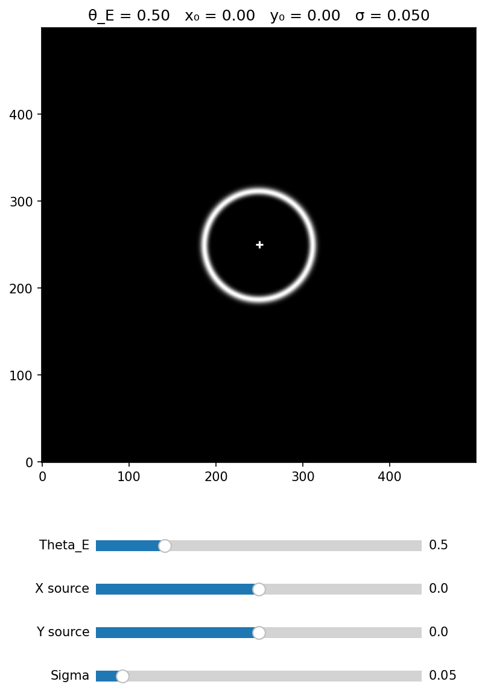
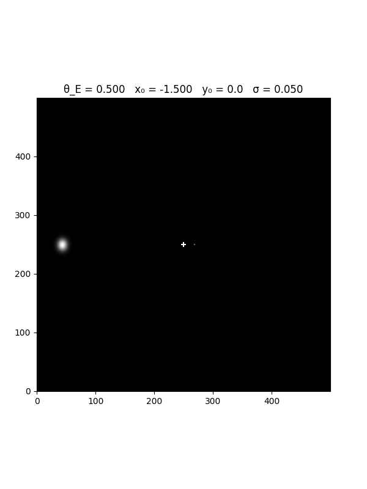

# Gravitational Lensing Simulator

A physically accurate simulation of gravitational lensing built in Python. The simulator models how a massive object bends light from a background source, producing Einstein rings, arcs, and quad image systems. Parameters are controlled via interactive sliders, with a separate animation window showing a source transit event in real time.



---

## Animation



*Source transiting across the lens field — watch the Einstein ring form, peak, and dissolve*

---

## Physics

When a massive object sits between a distant source and an observer, its gravity curves the surrounding spacetime. Light from the source follows these curved paths, arriving at the observer from unexpected directions — distorting, magnifying, and sometimes splitting the source into multiple images.

The simulation is governed by the gravitational lens equation:

```
β = θ − α(θ)
```

Where **β** is the true angular position of the source, **θ** is the observed image position, and **α(θ)** is the deflection angle caused by the lens. For a point mass lens this simplifies to:

```
α(θ) = θ_E² / θ
```

The Einstein radius **θ_E** is the single parameter that controls the strength of the lens — it encodes the mass of the lens and the geometry of the observer-lens-source system. When the source is perfectly aligned behind the lens, light wraps uniformly around it at radius θ_E, forming a complete Einstein ring.

Three lensing regimes are visible in the simulator:

- **Perfect alignment** — Einstein ring at radius θ_E
- **Slight offset** — ring breaks into two bright arcs
- **Large offset** — two distinct point-like images on opposite sides of the lens

---

## Features

- Real-time interactive sliders for Einstein radius, source position, and source size
- Physically accurate ray-tracing using the point mass gravitational lens equation
- Bicubic interpolation via `scipy.ndimage.map_coordinates` for smooth rendering
- Separate animation window showing a source transit microlensing event
- Lens position marker showing the centre of mass
- Live parameter readout in the plot title updating as sliders are dragged
- Clean modular codebase with NumPy-style docstrings throughout

---

## Installation

Clone the repository and install the required dependencies:

```bash
git clone https://github.com/jonathanholland26/gravitational-lensing-simulator.git
cd gravitational-lensing-simulator
pip install numpy matplotlib scipy
```

---

## Usage

Run the simulator directly:

```bash
python lensing.py
```

Two windows will open simultaneously:

- **Interactive window** — drag the sliders to control all parameters in real time
- **Animation window** — watch a source transit automatically across the lens field

### Slider controls

| Slider | Description | Range | Default |
|--------|-------------|-------|---------|
| Theta_E | Einstein radius — controls lens mass | 0.1 → 2.0 | 0.5 |
| X source | Horizontal source position | -1.5 → 1.5 | 0.0 |
| Y source | Vertical source position | -1.5 → 1.5 | 0.0 |
| Sigma | Source size | 0.01 → 0.5 | 0.05 |

### Tips

- Set X source and Y source to 0.0 for a perfect Einstein ring
- Drag X source slowly from 0 outward to watch the ring break into arcs
- Increase Theta_E to simulate a more massive lens
- Increase Sigma to see how source size affects the ring sharpness
- The Theta_E and Sigma slides affects both windows simultaneously

---

## Project Structure

```
lensing.py
│
├── make_grid()        # Builds the normalised 2D coordinate grid
├── deflect()          # Applies the gravitational lens equation
├── make_source()      # Generates the Gaussian background source
├── pixel_coords()     # Converts Einstein radius units to pixel indices
├── render()           # Samples the source via bicubic interpolation
├── update()           # Recomputes the lensed image for given parameters
│
└── if __name__ == "__main__"
    ├── Interactive figure with four sliders
    └── Animation figure with source transit
```

---

## Validation

The simulation is validated against the following analytic results:

- Einstein ring radius matches θ_E exactly at perfect alignment
- Two image positions follow θ± = (β ± √(β² + 4θ_E²)) / 2
- Total magnification follows the Paczynski formula μ = (u² + 2) / (u√(u² + 4))
- Images always appear on opposite sides of the lens center

---

## Roadmap

Planned extensions for future versions:

- Multiple source shapes — galaxy image, grid pattern, star field
- Binary lens model — two mass system used in exoplanet detection
- Singular Isothermal Sphere (SIS) — realistic galaxy mass profile
- NFW profile — dark matter halo lensing
- Magnification light curve plot alongside the animation
- Galaxy cluster lensing with multiple mass components

---

## References

- Narayan & Bartelmann (1996) — [Lectures on Gravitational Lensing](https://arxiv.org/abs/astro-ph/9606001)
- Paczynski (1986) — [Gravitational Microlensing at Large Optical Depth](https://articles.adsabs.harvard.edu/pdf/1986ApJ...301..503P)
  
---

*Built by Jonathan Holland — March 2026*
